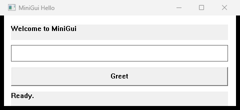
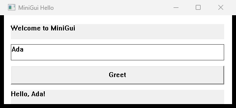

# MiniGui

MiniGui is a GUI library for MiniLang that helps you build simple desktop
applications quickly. You describe the user interface declaratively in `.mson`,
keep the application logic in normal MiniLang code, and let MiniGui generate and
compile the glue code for a native Windows application.

In short:

- `.mson` describes windows, layouts, controls, attributes, and events.
- `.ml` contains your application logic and event handlers.
- `tools/minigui.ml` is the MiniGui command-line tool.
- `MiniGuiLib/minigui.ml` is the runtime library for native Win32 controls.

## Screenshot

The minimal hello example is built from `examples/hello-gui/app.mson` and
`examples/hello-gui/app.ml`.





## Project Layout

MiniGui is its own project and is expected to live next to the MiniLang
compiler checkouts:

```text
MiniGui/
  MiniGui/
    MiniGuiLib/
    tools/
    examples/
    schemas/
    tests/
  MiniLangCompilerPy/
    mlc_win64.py
  MiniLangCompilerML/
    build/mlc_win64.exe
```

The Python compiler is currently the faster compiler for MiniGui builds.

## Quick Start

MiniGui itself is written in MiniLang. Build the CLI with the Python compiler:

```powershell
cd C:\Users\nilsk\Desktop\MiniGui\MiniGui
py -3.14 ..\MiniLangCompilerPy\mlc_win64.py .\tools\minigui.ml .\tools\minigui.exe -I . -I ..\MiniLangCompilerPy
```

Validate, generate, and build the hello example:

```powershell
.\tools\minigui.exe validate .\examples\hello-gui\app.mson
.\tools\minigui.exe generate .\examples\hello-gui\app.mson --output .\examples\hello-gui\build\app.gui.ml
.\tools\minigui.exe build .\examples\hello-gui\app.mson --output .\examples\hello-gui\build\hello-gui.exe --compiler ..\MiniLangCompilerPy\mlc_win64.py
```

Run the finished application:

```powershell
.\examples\hello-gui\build\hello-gui.exe
```

## CLI

```powershell
.\tools\minigui.exe validate <app.mson>
.\tools\minigui.exe generate <app.mson> --output <generated.gui.ml>
.\tools\minigui.exe build <app.mson> --output <app.exe>
```

Useful options:

- `--compiler <path>` selects the MiniLang compiler.
- `--output <file>` sets the generated source or executable output path.
- `--code-behind <file>` overrides the `codeBehind` value from `.mson`.
- `--generated-dir <dir>` chooses the directory for generated files.
- `--include-dir <dir>` adds MSON import search paths.
- `--no-compile` generates `.gui.ml` without compiling an executable.
- `--keep-generated` keeps generated files after `build`.

## A Minimal Application

`app.mson`:

```json
{
  "$schema": "../../schemas/minigui.schema.json",
  "version": 1,
  "namespace": "hello_gui",
  "codeBehind": "app.ml",
  "application": {
    "name": "HelloGui",
    "startupWindow": "mainWindow"
  },
  "windows": [
    {
      "id": "mainWindow",
      "type": "Window",
      "properties": {
        "title": "MiniGui Hello",
        "width": 480,
        "height": 220,
        "startPosition": "centerScreen"
      },
      "layout": {
        "type": "VerticalStack",
        "properties": { "padding": 14, "spacing": 8 },
        "children": [
          {
            "id": "headlineLabel",
            "type": "Label",
            "properties": { "text": "Welcome to MiniGui" }
          },
          {
            "id": "nameTextBox",
            "type": "TextBox",
            "properties": { "text": "" },
            "events": { "textChanged": "onNameChanged" }
          },
          {
            "id": "greetButton",
            "type": "Button",
            "properties": { "text": "Greet" },
            "events": { "click": "onGreetButtonClick" }
          },
          {
            "id": "resultLabel",
            "type": "Label",
            "properties": { "text": "" }
          }
        ]
      }
    }
  ]
}
```

`app.ml`:

```minilang
package hello_gui

import MiniGuiLib.minigui as MiniGui

function onNameChanged(ui, event)
  if event.newValue == "" then
    MiniGui.Control.setText(ui.resultLabel, "")
  end if
  return 0
end function

function onGreetButtonClick(ui, event)
  name = MiniGui.Control.getText(ui.nameTextBox)
  if name == "" then
    MiniGui.Control.setText(ui.resultLabel, "Please enter a name.")
  else
    MiniGui.Control.setText(ui.resultLabel, "Hello, " + name + "!")
  end if
  return 0
end function
```

For every control with an `id`, the generator creates a field on the generated
`ui` object. In the example above you can access `ui.nameTextBox`,
`ui.greetButton`, and `ui.resultLabel`.

## MSON Structure

An MSON file is JSON with the `.mson` extension.

```json
{
  "version": 1,
  "namespace": "my_app",
  "codeBehind": "app.ml",
  "resources": {},
  "imports": [],
  "application": {
    "name": "MyApp",
    "startupWindow": "mainWindow"
  },
  "windows": [],
  "components": []
}
```

Required fields:

- `version`: currently always `1`.
- `namespace`: the MiniLang package for the generated application.
- `application.name`: the application name.
- `application.startupWindow`: the `id` of the startup window.
- `windows`: the list of windows.

Optional fields:

- `codeBehind`: MiniLang file containing event handlers.
- `resources`: reusable values resolved at generation time.
- `imports`: additional `.mson` files.
- `components`: reusable UI building blocks.

## Layouts

Layouts group and position controls.

### VerticalStack

Arranges children from top to bottom.

```json
{
  "type": "VerticalStack",
  "properties": { "padding": 12, "spacing": 8 },
  "children": [
    { "id": "titleLabel", "type": "Label", "properties": { "text": "Title" } },
    { "id": "saveButton", "type": "Button", "properties": { "text": "Save" } }
  ]
}
```

### HorizontalStack

Arranges children from left to right.

```json
{
  "type": "HorizontalStack",
  "properties": { "spacing": 8 },
  "children": [
    { "id": "firstName", "type": "TextBox", "properties": { "width": "fill", "minWidth": 160 } },
    { "id": "lastName", "type": "TextBox", "properties": { "width": "fill", "minWidth": 160 } }
  ]
}
```

### Grid

Distributes children across columns. The `columns` property sets the column
count.

```json
{
  "type": "Grid",
  "properties": { "columns": 2, "spacing": 8 },
  "children": [
    { "id": "countryComboBox", "type": "ComboBox", "properties": { "items": ["DE", "US"] } },
    { "id": "cityListBox", "type": "ListBox", "properties": { "items": ["Berlin", "Bonn"] } }
  ]
}
```

### Canvas

Places controls at fixed `x` and `y` coordinates.

```json
{
  "type": "Canvas",
  "children": [
    { "id": "okButton", "type": "Button", "properties": { "text": "OK", "x": 20, "y": 20, "width": 100 } }
  ]
}
```

## Common Attributes

These properties can be used on controls:

- `text`: visible text.
- `width`, `height`: a number, `"auto"`, or `"fill"`.
- `x`, `y`: position inside a `Canvas`.
- `visible`: `true` or `false`.
- `enabled`: `true` or `false`.
- `margin`: reserved for layout spacing.
- `horizontalAlignment`: `"left"`, `"center"`, `"right"`, `"fill"`, or `"stretch"`.
- `verticalAlignment`: `"top"`, `"center"`, `"bottom"`, `"fill"`, or `"stretch"`.
- `alignment`: shorthand for horizontal alignment.
- `dock`: especially useful with `"fill"`.
- `fill`: `true` sets the width to the available space.
- `minWidth`, `minHeight`, `maxWidth`, `maxHeight`: size constraints.
- `tooltip`: tooltip text.
- `tabIndex`: keyboard navigation order.

Example:

```json
{
  "id": "nameTextBox",
  "type": "TextBox",
  "properties": {
    "text": "Ada",
    "width": "fill",
    "minWidth": 220,
    "enabled": true,
    "visible": true,
    "tooltip": "Enter a name",
    "tabIndex": 1
  }
}
```

## Controls

MiniGui currently supports these controls:

| Control | Purpose | Important properties | Events |
| --- | --- | --- | --- |
| `Label` | Display text | `text` | - |
| `Button` | Trigger an action | `text` | `click`, `clicked` |
| `TextBox` | Single-line input | `text`, `placeholder` | `textChanged`, `changed`, `change` |
| `TextArea` | Multi-line input | `text`, `placeholder` | `textChanged`, `changed`, `change` |
| `CheckBox` | Boolean choice | `text`, `checked` | `click`, `clicked` |
| `RadioButton` | Choice inside a group | `text`, `checked` | `click`, `clicked` |
| `Panel` | Borderless container | `padding`, `spacing`, `children` | - |
| `GroupBox` | Labeled container | `text`, `padding`, `spacing`, `children` | - |
| `ComboBox` | Drop-down selection | `items`, `selectedIndex` | `selectionChanged`, `selected`, `changed`, `change` |
| `ListBox` | List selection | `items`, `selectedIndex` | `selectionChanged`, `selected`, `changed`, `change` |
| `ScrollBar` | Scroll or value control | `orientation`, `minimum`, `maximum`, `value`, `smallStep`, `largeStep` | `scrollChanged`, `valueChanged`, `changed`, `change` |
| `Slider` | Trackbar value control | `orientation`, `minimum`, `maximum`, `value`, `smallStep`, `largeStep` | `scrollChanged`, `valueChanged`, `changed`, `change` |
| `ProgressBar` | Display progress | `minimum`, `maximum`, `value` | `scrollChanged`, `valueChanged`, `changed`, `change` |
| `TabControl` | Tabbed interface | `items`, `selectedIndex`, `children` | `selectionChanged`, `selected`, `changed`, `change` |
| `MenuBar` | Application menu bar | `items` | `click`, `clicked` |
| `ToolBar` | Toolbar | `items` | `click`, `clicked` |
| `StatusBar` | Status line | `text` | - |
| `TreeView` | Tree navigation | `items` | `selectionChanged`, `selected`, `changed`, `change` |
| `ListView` | List/report view | `items`, `selectedIndex` | `selectionChanged`, `selected`, `changed`, `change` |
| `Table` | Table-like list, currently backed by `ListView` | `items`, `selectedIndex` | `selectionChanged`, `selected`, `changed`, `change` |
| `DatePicker` | Date input | `text` | `textChanged`, `changed`, `change` |

## Control Examples

### Button

```json
{
  "id": "saveButton",
  "type": "Button",
  "properties": { "text": "Save", "width": 120, "height": 30 },
  "events": { "click": "onSaveClick" }
}
```

```minilang
function onSaveClick(ui, event)
  MiniGui.Control.setText(ui.statusBar, "Saved")
  return 0
end function
```

### TextBox and TextArea

```json
{
  "id": "notesTextArea",
  "type": "TextArea",
  "properties": {
    "text": "Notes",
    "height": 80,
    "width": "fill",
    "placeholder": "Enter notes"
  },
  "events": { "change": "onNotesChanged" }
}
```

```minilang
function onNotesChanged(ui, event)
  MiniGui.Control.setText(ui.statusBar, "Text changed: " + event.newValue)
  return 0
end function
```

### CheckBox and RadioButton

```json
{
  "id": "advancedCheckBox",
  "type": "CheckBox",
  "properties": { "text": "Advanced options", "checked": true },
  "events": { "click": "onAdvancedClicked" }
}
```

```minilang
function onAdvancedClicked(ui, event)
  enabled = MiniGui.Control.isChecked(ui.advancedCheckBox)
  MiniGui.Control.setEnabled(ui.detailsPanel, enabled)
  return 0
end function
```

### ComboBox and ListBox

```json
{
  "id": "countryComboBox",
  "type": "ComboBox",
  "properties": {
    "items": ["Germany", "United States", "France"],
    "selectedIndex": 0,
    "width": "fill"
  },
  "events": { "selected": "onCountrySelected" }
}
```

```minilang
function onCountrySelected(ui, event)
  selected = MiniGui.Control.getSelectedText(ui.countryComboBox)
  MiniGui.Control.setText(ui.resultLabel, "Country: " + selected)
  return 0
end function
```

### Slider, ScrollBar, and ProgressBar

```json
{
  "id": "volumeSlider",
  "type": "Slider",
  "properties": {
    "orientation": "horizontal",
    "minimum": 0,
    "maximum": 100,
    "value": 25,
    "smallStep": 5,
    "largeStep": 20,
    "width": "fill",
    "height": 32
  },
  "events": { "valueChanged": "onVolumeChanged" }
}
```

```minilang
function onVolumeChanged(ui, event)
  MiniGui.Control.setText(ui.volumeLabel, "Volume: " + event.newValue)
  MiniGui.Control.setValue(ui.progressBar, event.newValue)
  return 0
end function
```

### Panel and GroupBox

```json
{
  "id": "customerGroup",
  "type": "GroupBox",
  "properties": {
    "text": "Customer",
    "height": 120,
    "width": "fill",
    "padding": 10,
    "spacing": 8
  },
  "children": [
    { "id": "nameTextBox", "type": "TextBox", "properties": { "width": "fill" } },
    { "id": "emailTextBox", "type": "TextBox", "properties": { "width": "fill" } }
  ]
}
```

### TabControl

```json
{
  "id": "tabs",
  "type": "TabControl",
  "properties": {
    "items": ["Input", "Data"],
    "selectedIndex": 0,
    "height": 220,
    "width": "fill"
  },
  "events": { "selected": "onTabSelected" },
  "children": [
    { "id": "inputPanel", "type": "Panel", "properties": { "height": 80 } },
    { "id": "dataPanel", "type": "Panel", "properties": { "height": 80 } }
  ]
}
```

### ToolBar, MenuBar, and StatusBar

```json
{
  "id": "mainToolBar",
  "type": "ToolBar",
  "properties": {
    "items": ["New", "Open", "Save", "Refresh"],
    "height": 30,
    "width": "fill"
  },
  "events": { "click": "onToolbarClick" }
}
```

```json
{
  "id": "statusBar",
  "type": "StatusBar",
  "properties": { "text": "Ready", "height": 24, "width": "fill" }
}
```

### TreeView, ListView, Table, and DatePicker

```json
{
  "type": "Grid",
  "properties": { "columns": 2, "spacing": 8 },
  "children": [
    {
      "id": "navigationTree",
      "type": "TreeView",
      "properties": { "items": ["Customers", "Orders", "Reports"], "height": 120 },
      "events": { "selected": "onTreeSelected" }
    },
    {
      "id": "customerTable",
      "type": "Table",
      "properties": {
        "items": ["Ada Lovelace", "Grace Hopper", "Margaret Hamilton"],
        "selectedIndex": 0,
        "height": 120
      },
      "events": { "selected": "onTableSelected" }
    }
  ]
}
```

```json
{
  "id": "birthDatePicker",
  "type": "DatePicker",
  "properties": { "width": 150 },
  "events": { "changed": "onDateChanged" }
}
```

## Events and Code-Behind

Event handlers live in the code-behind file and must accept exactly two
parameters:

```minilang
function onSomething(ui, event)
  return 0
end function
```

`ui` is the generated handle to windows and controls. `event` contains:

- `sender`: the control that raised the event.
- `eventType`: the event name.
- `oldValue`: previous value, when available.
- `newValue`: new value, when available.
- `cancel`: can be set to `true` in a `close` handler.

Window events:

- `load`
- `close`
- `resized`

Close-event example:

```json
{
  "id": "mainWindow",
  "type": "Window",
  "events": { "close": "onMainWindowClose" },
  "layout": { "type": "VerticalStack", "children": [] }
}
```

```minilang
function onMainWindowClose(ui, event)
  if MiniGui.Control.getText(ui.nameTextBox) == "" then
    event.cancel = true
    MiniGui.Control.setText(ui.statusBar, "Please enter a name first.")
  end if
  return 0
end function
```

## Runtime API

The most useful functions from `MiniGui.Control`:

```minilang
MiniGui.Control.setText(control, "Text")
text = MiniGui.Control.getText(control)

MiniGui.Control.setEnabled(control, true)
MiniGui.Control.setVisible(control, false)

MiniGui.Control.setBounds(control, 20, 20, 200, 30)
MiniGui.Control.setPosition(control, 20, 20)
MiniGui.Control.setSize(control, 200, 30)

checked = MiniGui.Control.isChecked(control)
MiniGui.Control.setChecked(control, true)

MiniGui.Control.addItem(control, "Item")
MiniGui.Control.setItems(control, ["A", "B", "C"])
MiniGui.Control.clearItems(control)
index = MiniGui.Control.getSelectedIndex(control)
MiniGui.Control.setSelectedIndex(control, 1)
text = MiniGui.Control.getSelectedText(control)

MiniGui.Control.setScrollRange(control, 0, 100)
MiniGui.Control.setScrollSteps(control, 5, 20)
MiniGui.Control.setScrollValue(control, 50)
value = MiniGui.Control.getScrollValue(control)

MiniGui.Control.setValueRange(control, 0, 100)
MiniGui.Control.setValue(control, 35)
value = MiniGui.Control.getValue(control)
```

`setValue` and `getValue` are useful for `Slider`, `ScrollBar`, and
`ProgressBar`. For `ComboBox` and `ListBox`, use the selection functions.

## Resources

Resources are simple values that are resolved while generating MiniLang code.

```json
{
  "resources": {
    "windowTitle": "MiniGui Control Gallery",
    "heading": "MiniGui controls and attributes"
  },
  "windows": [
    {
      "id": "mainWindow",
      "type": "Window",
      "properties": {
        "title": { "$resource": "windowTitle" }
      },
      "layout": {
        "type": "VerticalStack",
        "children": [
          {
            "id": "titleLabel",
            "type": "Label",
            "properties": { "text": { "$resource": "heading" } }
          }
        ]
      }
    }
  ]
}
```

## Imports and Components

`imports` loads additional `.mson` files relative to the importing file or from
the `--include-dir` search paths.

```json
{
  "imports": ["resources/common.mson", "components/address-form.mson"]
}
```

Components are reusable UI building blocks:

```json
{
  "components": [
    {
      "name": "AddressForm",
      "content": {
        "type": "VerticalStack",
        "properties": { "spacing": 8 },
        "children": [
          { "id": "streetTextBox", "type": "TextBox", "properties": { "width": "fill" } },
          { "id": "cityTextBox", "type": "TextBox", "properties": { "width": "fill" } }
        ]
      }
    }
  ]
}
```

Use the component by its name:

```json
{
  "id": "shippingAddress",
  "type": "AddressForm"
}
```

When a component is used multiple times, MiniGui prefixes internal IDs with the
instance ID.

## Examples

- `examples/hello-gui`: a small application with `TextBox`, `Button`, `Label`,
  and event handlers.
- `examples/control-gallery`: a test and demo application covering all
  controls, attributes, layouts, and event binding paths.
- `examples/customer-form`: an example for imports, resources, and components.

Build the control gallery:

```powershell
.\examples\control-gallery\build.ps1
```

## Tests

The MiniGui test suite builds the CLI, validates the example applications,
checks generated code, starts GUI smoke tests, and verifies interactions such as
button clicks, slider changes, and resize behavior.

```powershell
.\tests\minigui\run_minigui_tests.ps1
```

## Compiler Requirements

MiniGui uses native interop helpers from the MiniLang compiler:

- `nativeCallback(fn, "wndproc")`
- `nativeBytesPtr(bytes)`
- `nativeRawValue(value)`
- `nativeValueFromRaw(int)`

`MiniGuiLib` uses these helpers for Win32 windows, window procedures, native
handles, and callback bridges.

## Extending MiniGui

To add a new control:

1. Extend control metadata and validation in `tools/minigui.ml`.
2. Implement the runtime constructor in `MiniGuiLib/minigui.ml`.
3. Update `schemas/minigui.schema.json`.
4. Extend the control gallery and tests.

The public MSON shape should stay stable: applications describe the UI
declaratively while the runtime hides native implementation details.
